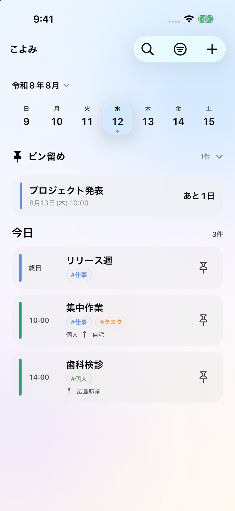

# こよみ — Koyomi


予定とタスクをひとつの時間軸で管理する、iOS 26以降向け個人カレンダーアプリです。
作成・編集・完了・複製・削除から、大切な予定のピン留めとカウントダウンまでをアプリ内で完結できます。



## できること

- EventKitでiPhoneに登録済みのカレンダーを表示・管理
- 予定／タスクの作成、編集、複製、削除
- 日時・終日・保存先Calendar・場所・メモ・複数通知・繰り返しの設定
- 日付未確定のタスクを「目安日＋前後の幅」で登録。EventKitでは最早日〜最遅日の終日帯と`#見込み`で保持
- 見込みタスクは作成時に自動ピン留めし、期間前／期間内／期限超過を日単位で表示
- `#タスク`を完了／未完了に切り替え、直後ならUndo
- 再発予定は「この予定のみ」「これ以降すべて」を明示して変更
- 読み取り専用Calendar、競合、曖昧な予定照合は変更せずfail closed
- タイトル・タグ・Calendar・場所・メモの検索と、予定／見込み／未完了／完了済みフィルター
- 終日・時間指定・日をまたぐ予定を日付ごとに表示
- 予定のピン留め／解除
- ピン留めを画面上部に常設。通常予定は秒単位、見込みタスクは日単位で期間前／期間内／超過を表示
- 複数ピンを横スクロールで確認
- 日付ストリップ、グラフィカル日付選択、今日へ移動、プル更新
- Small / Medium / Largeホーム画面ウィジェット（Largeは最大7件）
- accessory rectangularロック画面ウィジェット
- ピンした予定をウィジェットから開くディープリンク
- 予定名末尾の任意の`#タグ`を本文から分離し、色付きチップで表示
- `すべて / #重要 / #タスク / #仕事 / #メモ / 任意のプロジェクトタグ`で日別・予定一覧を絞り込み
- Widgetではタグを除いた読みやすいタイトルを表示
- iOS 26のLiquid Glass。ガラスはピン領域と操作部に絞り、Reduce Transparency時は不透明度の高い代替表示

Googleカレンダーも、iOSの「カレンダー」に同期済みであればEventKit経由で表示されます。

## タグとHermes Agent

人が読むタイトルを先に書き、空白を挟んでタグを末尾に置きます。

```text
ClinicalAI 定例 #仕事 #ClinicalAI
請求書を送る #タスク #重要 #TeslaEC
あとで調べる：音声UI #メモ #AI
```

アプリ内にAI SDKやGoogle認証情報は入れません。Koyomi自身の変更はEventKit経由で同期先Calendarへ保存します。Hermes Agentもユーザーの明示指示に基づいてGoogle Calendar側を操作でき、両者は同じCalendarタイトルと`#タグ`規約を共有します。詳しい記法と安全境界は[`docs/calendar-title-tags.md`](docs/calendar-title-tags.md)を参照してください。

## データとプライバシー

- バックエンド、ログイン、分析SDK、外部通信はありません。
- カレンダー内容を端末外へ送信しません。
- 共有Keychainに保存するのは、ユーザーがピン留めした予定の表示用スナップショットだけです。
- スナップショットにはタイトル、開始・終了、終日フラグ、カレンダー名・色、場所を含みます。メモ、参加者、URL、アラームは保存しません。
- Widget extensionはEventKitへ直接アクセスせず、共有スナップショットだけを読みます。
- カレンダー権限は初回画面のボタンを押したときに要求します。Full Access時だけ管理機能を有効化し、拒否・制限・書き込み専用の各状態には個別の案内があります。

## 必要環境

- macOS 26
- Xcode 26.6
- iOS 26.0以降のiPhone
- 同一TeamでKeychain Sharingを有効化できるApple Developer環境

## 開発

`Koyomi.xcodeproj`はコミット済みです。構成を変更した場合はXcodeGenで再生成できます。

```bash
brew install xcodegen
xcodegen generate
open Koyomi.xcodeproj
```

コアロジックだけをテストする場合:

```bash
swift test
```

CIはGitHub-hosted `macos-26` / Xcode 26.6で、Swift Packageのユニットテスト、App unit test、iOS Simulator上の一時Calendarを使うEventKit round-trip、UIテスト、Simulatorビルドを実行します。

## 実機署名

`Koyomi` と `KoyomiWidget` は同じApple Developer Teamで署名し、`$(AppIdentifierPrefix)run.kan.koyomi.shared` Keychain access groupを共有します。App GroupのDeveloper Portal設定は不要です。

1. `Koyomi` と `KoyomiWidget` のTeamを同じApple Developer Teamへ設定する。
2. Bundle ID `run.kan.koyomi` と `run.kan.koyomi.widget` がTeamで利用可能か確認する。
3. `xcodegen generate` を実行する。
4. iPhoneを接続して `Koyomi` schemeをRunする。

`project.yml`はKanのTeam IDを既定値にしています。別Teamで利用する場合はTeamとBundle IDを変更してください。共有Keychain groupの`$(AppIdentifierPrefix)`は署名Teamに合わせて展開されます。

## 構成

- `Shared/` — 予定スナップショット、カウントダウン、ピン永続化、日付範囲・再照合ロジック
- `Koyomi/` — EventKitアダプター、状態管理、Liquid Glass UI
- `KoyomiWidget/` — 共有Keychainのピンを読むWidgetKit extension
- `KoyomiTests/` — Foundation中心のユニットテスト
- `KoyomiAppTests/` — ViewModelと実EventKitのApp unit / integration test
- `KoyomiUITests/` — 権限不要のデモデータを使うUIテスト

WidgetKitのタイムライン更新時刻はシステムが最終決定します。表示中のカウントダウン自体はSwiftUIのタイマーテキストで進み、開始・終了境界ではタイムライン更新を要求します。
